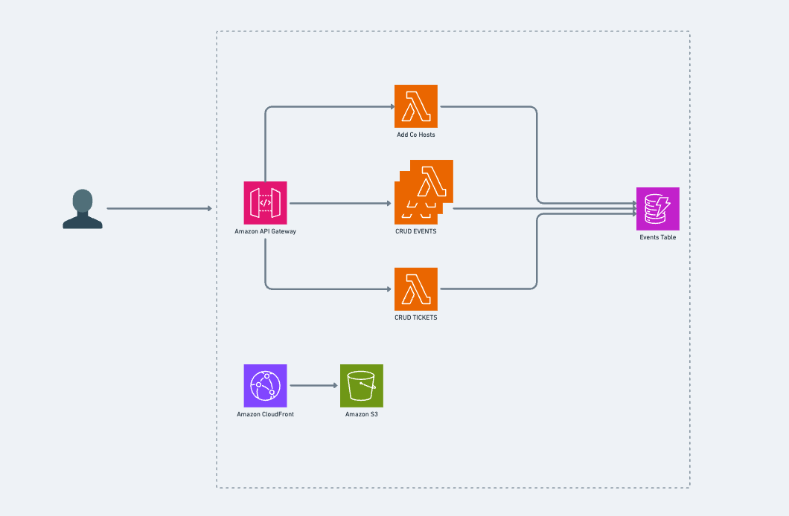
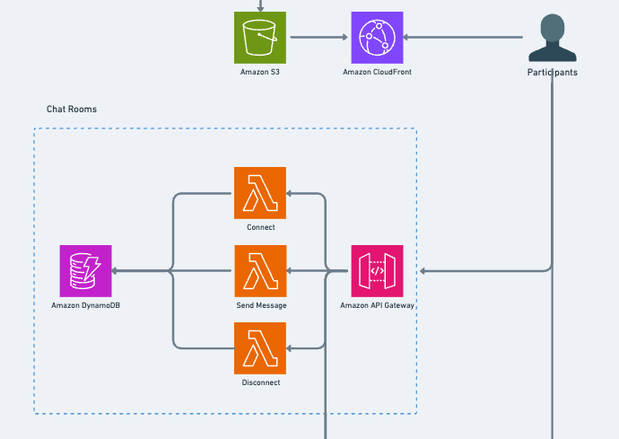
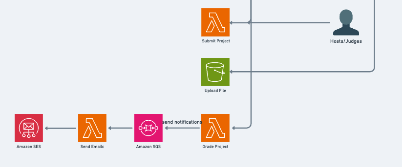
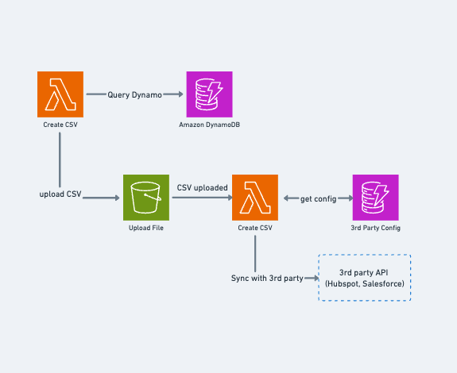

# Event Hackaton Hosting Platform

You can read the details of the challenge at [Serveless Challenge](https://serverlessmasterclass.substack.com/p/serverless-architecture-challenge-b91)

## Event Planning and Ticketing

Let's start from the Event Planning and Scheduling requirements:

- Allow organizers to plan and schedule virtual events.
- Provide a user-friendly interface for setting up event details.
- Organisers can invite people to be co-hosts for the event.
- Organisers can create a set of judging criteria. This means the participants know what they are going to be doing

For these features, I went for an React Single Page App where organisers can create and schedule events. The app will be hosted on a S3 Bucket backed by a Cloudfront distribution. To invite people as co-hosts, it will to be handled as a role in the Auth system. The idea is to use Cognito User Pools with different set of roles defined in Identity Pools.

For the ticketing and registration system, the requirements are the following:

- Implement a ticketing system for event registration.
- Provide options for different ticket types and pricing.

I imagined this as a page in the front end app with the event details and a form to register to the event. Every time there is a new registration, I add a entry in Dynamo with participant details, ticket type and price paid. There are no specifications on how we're gonna handle the payment system, but we may need to integrate a callback to check if the payment was successfull or not.

## Virtual Venues

The virtual venues are web application where hosts can livestream a welcome video to all participants, participants can ask questions in a live chat. There are different way to implement this with 3rd party providers, but I'll try to stick with AWS.
Videos need to be streamed with sub 5s latency. Since the requirement is to have a one way video to N participants, we can choose AWS Elemental MediaPackage with Low Latency to stay around 5-8 seconds and a CDN Cloudfront distribution to distribute the video.

On the streamer side, so the hosts and co-hosts publishing the video, we need to use Chime SDK to push the video from the webcam to a RTMP endpoint. Following this guide should help: https://aws.amazon.com/blogs/business-productivity/amazon-chime-sdk-launches-live-connector-for-streaming/

For the live chat, we need a WebSocket connection. It's been a few years since API Gateway + Lambda supports Websocket so I will follow that route. The main endpoints are:

- a connect endpoint, where participants connect to the websocket
- send message endpoint, where participants can send a message with a payload that will contain the text of the message
- listeners for events, so everytime there is a new message the others connected to the same room will receive it
- a disconnect endpoint, which is triggered when a user disconnect from the the room

For message handling, stats about who has connected/disconnect I will use a dedicated dynamodb table.
On the connection route, we probably need to specifiy a parameter such as {roomName} to handle different rooms/events.
The DynamoDB Table will contain PK roomId and SK ConnectionId

A comprehensive guide can be found at https://docs.aws.amazon.com/apigateway/latest/developerguide/websocket-api-chat-app.html

## Hackaton Teams

We can use the same approach, using WebSocket API with LAmbda and a DynamoDB table to handle the Hackatno teams breakout rooms.

### Team submission

- At the end of the hackathon, teams can submit their projects. This includes description and details, but also a file upload for any files required.
- Hosts and organisers can view all submissions.
- Submissions can be graded and participants get feedback on their submission.

For this requirements, having a S3 bucket with a path such as {hackatonId}/{teamId}/submission would meet the requirement of having teams uploading files and hosts and organisers view submissions. Since hosts can grade the submission, there could be a Lambda function with an API Gateway to handle this data and connect a trigger to send an email to the participants when the judges have reviewed their project

## Analytics for Particpants engagements

A way to track participants engagements is to record how long they are staying connected to the live event and to the hackaaton teams chat room, adding also the number of messages exchanged in the room. This should give us an idea on who has been active during the hackaton.

This data is available on the DynamoDB Table so it's a matter of running queries and display the data. Ideally, I would like to have dashboards with this data so we can think of integrating Athena and Quicksights?

// https://dev.to/awscommunity-asean/visualising-your-amazon-dynamodb-data-with-amazon-quicksight-14n4

## Participants export

### CSV Export

On the client app, we should implement a "download CSV" function that query dynamodb data and create a CSV File.
The idea is to have a Lambda function which runs a query agains dynamoDB table and creates the CSV File.

### Connect to Hubspot and Salesforce

AT a high level, CRM exposes API To upload data in a given format. We can connect it using a Lambda function as:

## Customisation:

`Allow customers to upload a logo and set two colours for branding purposes`

This should be as easy as having an S3 bucket and force the logo to be 128x128 to not have a Lambda to resize the image. SAve image and colors preferences in a user preferences table

## User Roles

`Define roles such as event organiser and event host`: this can be done with Cognito user identity

# Self Review Questions

## Security:

How do you secure your data in transit? HTTPS

How do you secure your data at rest? DynamoDB is encrypted at rest

How is your architecture protected against malicious intent? (APIs and Storage)

For the APIs I will use Cognito, I might need to add WAF for DDOS protection. Database is only accessible from API and Lambda.

## Reliability:

How would your infra react if an availability zone went offline for an hour? Would your application still be usable? Would there be any temporary or permanent loss of data? Would that be acceptable?

Everything should work as exptected becasue services are multi-az, there might be some failures but nothing more

How would your infra react if a whole region went offline for an hour? Would your application still be usable? Would there be any temporary or permanent loss of data? Would that be acceptable?

Probably only the react app would work because cached withing cloudfront. APIs will fail but there won't be any loss of data.

How would your application react if your traffic increased 10x in 5 minutes? (An advert plays on tv) Would your compute and database scale up to handle this quick increase in traffic. Might you hit some service limits?

Let's say we have 5000 concurrent users, and we grow to 50k users. The limit that I see in the chat room is the Websocket quotas which is limited to 500 new connection per second. I shouldn't hit that limit.

If a developer added a recursive bug to the code that caused memory usage to spike, how would your application handle it?

Probably the Lambda would become unusable but the bug is isolated to that specific function

What would happen if your database was corrupted or accidentally deleted?

I have Point in time recovery

## Performance

Might anything in your application cause user requests to fail to meet latency requirements?

Should be all good with APIGW + Lambda

How do you configure and optimise your compute resources? (EC2 instance type / Lambda memory)

Based on usage and data on latency I would optimise Lambda memory

What should the team be monitoring to ensure optimal performance?

API Response Time, Errors,

## Cost Optimisation

What is the rough cost to run this application?

Let's assume an event of 500 people and a welcoming stream of 1 hour. We pay for 1hour streaming

We pay for 1 host + 1 co-host to stream + 500 participants = 502 attendees _ 60 minutes _ $0.0017 = $51 per session.

For the breakout room, the websocket pricing is $1 per billion messages and $0.25 per million connection minutes.
Assuming that hackatons last 5 days (guessing), and attendees stay connected 8 hours per day. Each user sends 100 messages and receives 500 messages per day. Each message size is 3KB.

MESSAGES: (100 (sent msgs) + 500 (received msgs)) _ 500 (users) _ 5 (days) = 1.5M messages , so we pay $1.5 per messages
CONNECTION: 500 attendess _ 8 _ 60 minutes \* 5 days = 1.2 M minutes so we pay $0.50 for the websockets.

What is the most expensive component of your application?

The media streamer

What designs/patterns have been implemented to optimise costs? Serverless

What optimisations could be made to your architecture if the scale requirements were 100x?

## Sustainability

How does your architecture make the most of user usage patterns to improve sustainability?

## Project specific questions / things to watch out for

How are you ensuring GDPR compliance?

- Explicit authorisation to store and use data
- Personal Data Security (storage and protection from unauthorised access)
- Ability to request data
- Ability to request the deletion or anonymisation of any of their data

GDPR should be ensured by AWS services + cookies

What is the latency on the video solution you’ve gone with? Low Latency RTMP 5-8s

If a user disconnects from any of the chats (main or team) will they be able to get the message history?

yes because the idea is to save messages on dynamodb

Are there any limitations on the number of participants in the event? Some video streaming tools have a limit on the number of connections

USing Live streaming with RTMP + HLs there are no limits

How ‘real time’ will your analytics be?

Fairly real time

How are you tracking the number of participants who joined an event? How certain are you that there won’t be missed or double counts? This is used for billing!

Tracking connection event with connectionId and roomId in DynamoDB + handling failure with a DLQ on the LAmbda that is storing the data

You have a busy weekend and hit 5000 concurrent participants. Estimate that they are each sending 2 messages / min. Will this be an issue for your application?

This is within services quotas

You are asked to add a feature. Video chat for breakout teams. How difficult would it be to implement a feature like this?

This needs a good amount of work because we need to add two way audio-video communication using Chime SDK

A large company wants to do a company-wide hackathon. They have 15,000 staff. They want users to be able to log into the event using their company credentials. You still need to support other customers whilst this event is happening
How complicated would it be to extend your current architecture to handle this?

I need to create a user pool with SAML integration for their company auth system.

Are there any known limitations in your current architecture that could become an issue with increased scale?

No
