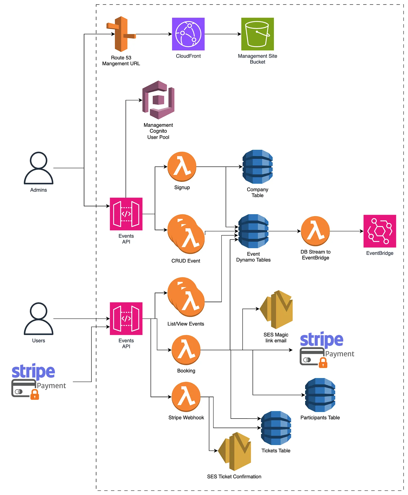
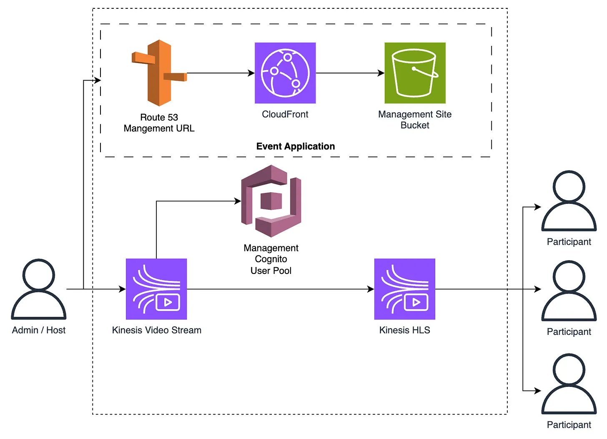
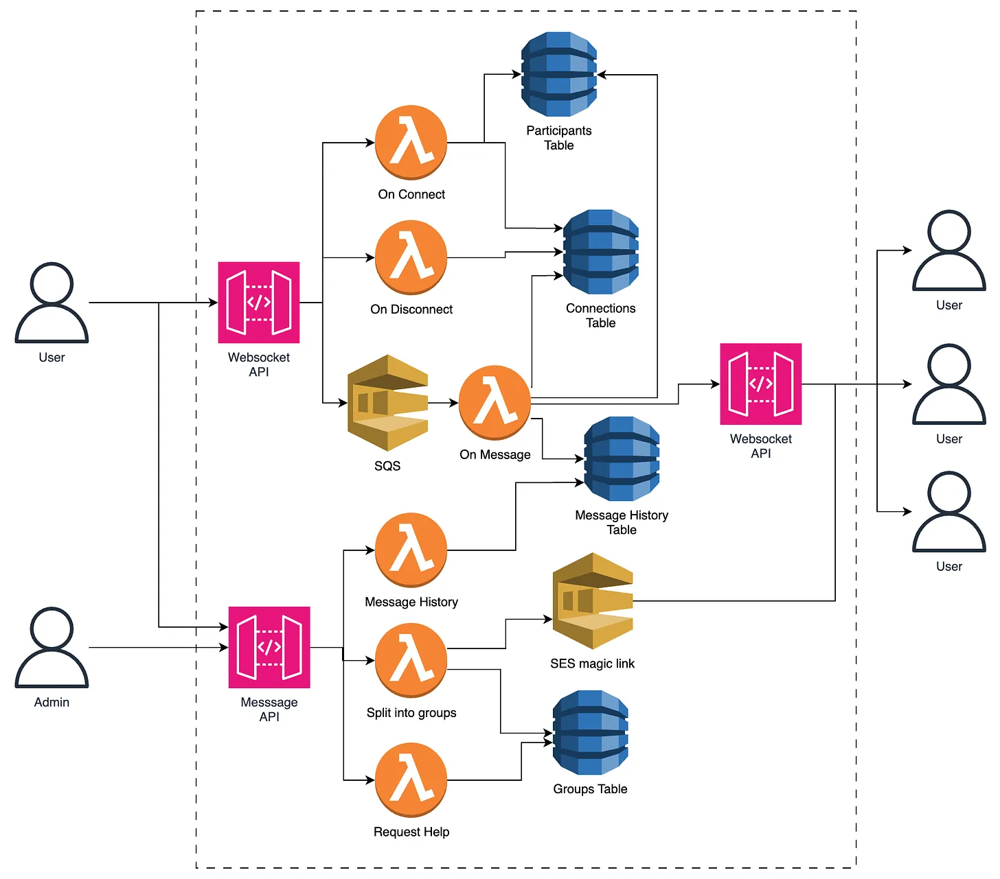

# **My Approach**

I’m going to split this architecture into 3 sections

- Event management & ticketing
- Event hosting
- Analytics and exports

## **Event management & ticketing**

This is the core of any e-commerce platform. Admins create and update products (in our case events), and users browse products, view details and then purchase (purchases can be free).

This will use the standard react site hosting pattern, using S3 to host the react (or any other static site), Cloudfront to act as CDN and Route 53 to give it a custom domain name.

People who want to create an event can sign up (registering with Cognito as Event Admins), and then they’re in the interface for creating an event. Here they can add as many details as they want about the event. By default, all events would be stored as `drafts` until they confirm they want to make the event live.

At this point, they can also add the ticket types they want for the event. These could be free tickets, or paid ones. If an event has paid tickets, the admin needs to connect their stripe account before they can make it ‘live’.

Admins are able to log in and view all of their current and existing events.

This app would also have a view where users can see what events are coming up. This would have some basic filtering on it ( Business Type ) as well as date search. A user can select any of these events to see more details and go on to purchase a ticket. When a user goes to purchase a ticket, they will agree to T&C (GDPR) and then register by clicking a magic link that is sent to their email address. They can then purchase through Stripe if it is a paid ticket. 100% of the ticket price would be transferred to the event admin’s stripe account.

I chose to go with this authentication method as it removes the need for every participant to be in Cognito ($0.05/ active user/month). They would have a user account in a Dynamo table and would be sent purchase confirmation and login emails with a magic link. If they want to view their upcoming events or anything like that, they will be sent a magic link that will store a temporary credential in their browser for accessing the API.

Saving $0.05 per participant doesn’t sound like a lot, but when you only make $1 per participant its 5% of your income. Consider that a user might sign up 2 months ahead, check the details a few days before and then sign in on the event day. This would count as one user for 3 months = $0.15 which is now a very large split of the revenue for a single service in the application.

## **Event hosting**

When I look at this I see two main components:

- Video live stream
- Text chat

I would have a separate front-end application for the event app. This would isolate it from the normal website.

Admins and hosts would log into the app using Cognito, participants would be sent magic links.

### **Video live stream**

I’m not an expert in video live streaming, so there may be alternative solutions that may work and meet the requirements more effectively.

I chose to go with a Kinesis video stream for this. I would create a second application for this so we can install the SDK into the app without bloating the main website. This SDK enables us to stream the ‘host’ video feed into AWS and then stream that video out to all active participants with HLS (HTTP-Livestreaming).

We also have the option here to store the live stream data. This would theoretically allow for the ability to create ‘recorded events’ which use a pre-recording of the event. Not a feature that has been asked for, but one I thought could be done in the future. This platform will continue to be worked on by a team of devs after release.

There are other options including peer-to-peer video, but I don’t know how well that would perform when streaming from one host to 500 participants.

### **Text Chat**

For this I would go with WebSockets API in API Gateway, sending messages to SQS FIFO before being handled by a Lambda. This pattern is used to ensure that when there are 5000 participants at once they don’t all send a message at once and make us hit the Lambda Concurrency limit. Setting the Lambda concurrency for this task to something sensible like 100 should keep the queue empty. The SQS queue length should be monitored. If it starts creeping up during busy times then the concurrency limit on the Lambda could be increased, and a service limit request made to AWS incase you need to increase it further.

The app would create a separate connection for the main event chat as well as the breakout group chat but they would be hitting the same API and Lambdas. The connection details for each of these would be stored in Dynamo as separate records.

pk = ${connectionId} \
pk2 = ${ eventId }-${ ‘main’ / breakoutGroupId } sk2 = ${connectionId} \
eventId, connectionGroup, userId.

With this schema, we can get the connection for the incoming message using the connectionId. The message will be stored in a message history table, and the user details (name, icon) can be found to generate the message to be sent to everyone else in the group. We then use the eventId and connectionGroup to query on the table for the rest of the connnections in that group and send them that message.

Some extra steps need to be done around `onConnection` and `onDisconnect` to keep the database as clean as possible. When connecting, we need to validate the user’s magic link code and add their connection to the connection table. On disconnect needs to remove their connection from the connection table.

Another thing that needs to be done ‘onConnection’ is to get the recent message history. This can be queried from the message history table. I would recommend limiting this query to the 20 most recent messages. If someone scrolls back up to the top of that list, we have an API to get earlier blocks of messages.

#### **Team Chat**

This will work the same as main chat system. When the admin clicks the breakout button, it will split all participants into groups and then send an email with their group page link. User can also go to a page where they input their email address to re-trigger that email if they managed to lose it.

## **Analytics and exports**

Admins and hosts will have a new view where they can see analytics and other management details for the event.

Analytics will be provided using CloudWatch events as the underlying platform. When a user interacts with the event (registers, first connect, sends a message, team submission ) we’ll fire events. We’ll also have the participant UI send a connection monitoring event every minute. This will give us the ability to show how long each of the participants was connected to the event. A user who joined for 3 minutes and left is less likely to respond to future communication than one who was part of the event for 5 hours and sent 400 messages in the chats.

For live analytics, I would use a platform like Grafana that is connected to our CloudWatch events. These dashboards would be embedded into the admin event application so they can monitor participation in real-time.

Another view in the admin panel will be a list of all groups. Participants will have a button in their UI to be able to “ask for help” which will set a flag on the admins’ dashboard. This dashboard will be updated with a third WebSocket connection that only admins have. This is fed by a DynamoDB stream so that when a user requests help, it goes through the stream and notifies all of the connected admins for that event. Any of the admins/hosts can click the ‘join’ button on any team (not just ones asking for help) and they open a new chat window for that team.

For the final analytics for an event, there will be an EventBridge schedule for 2 hours after the event finishes. One process that is listening to this event will be a ‘post-event analytics accumulation’ Lambda. This will run all of the analytics queries and store them into a event analytics table. This means we don’t have to run the same query every time an admin wants to view some analytics.

### **Fees**

One analytics process that does need to happen after the event has been completed is the calculation of the fees. This would be calculated based on the number of participants who signed up for the event. This would be used to make a direct debit charge and a notification email sent.

To make that email better, the other analytics would be included such as total revenue from the event (if they had paid tickets), total attendees, total chat messages sent and number of submissions. These data points would make the customer realise the value they got from the event for the minimal cost of using our tool.

### **Exports**

To export the participant data, there would be an API which queries the Dynamo table for the given event and gets all participant data for the event. If they want to export via csv then it can be generated by the Lambda and then sent back in the API response. We would also send it via email.

If the admin wants to export to HubSpot or Salesforce then they can set up the integration to their account. This will involve storing the API credentials that our system needs. When the ‘post event schedule’ is fired, this process will be triggered, to gather all user data, transform it into the format required by the CRMs and then send it using credentials stored in param store.

## **GDPR Points**

GDPR is something that a lot of people have heard about but not as many people have had to implement. In short, it is about what Personal Identifiable Information (PII) you can store and what you have to do if a user requests it or requests that you delete it.

**\* I am NOT a lawyer or PII / GDPR specialist. Do your own research and discuss this with a lawyer / GDPR specialist if you have any doubts or questions!**

There are lots of very complicated rules about what you are and aren’t allowed to store and what you have to do once a user requests its removal. I tend to try and stay on the cautious side of the line, making this easy to delete, anonymise, pseudonymise or automatically delete non-critical data that might contain PII.

- When a user signs up to go to an event, they have to confirm that they are ok with us storing their PII and sharing it with the companies whose events they sign up for.
- Chat message history records are automatically deleted after 25 days (TTL on the record). This ensures that any PII sent in chat is removed, even if a user requests deletion the day of the event. (You have 30 days to meet the requirements). I wouldn’t delete it as soon as the event ends as the event organisers may want to view the chat messages ( future feature ).
- If a user wants to request their data (or request its deletion), we have a UI in the main app to do this. They get sent a magic link to confirm their identity. This puts an event into an SQS queue so that it can be processed by a single Lambda. If an event tells all 500 participants to submit a request at once then you could hit the Lambda concurrency limit.
- Requests for information would get their user details, as well as any submissions from their teams, as well as all messages they sent and analytics data. This would cover all of the data we would have on them.
- Requests for deletion would delete the user record. The submission records would then be left with a contributorId that would connect to a non-existent user record. Ensuring that the submission contributors are listed by id, not by username or email, means the data is pseudonymised, making GDPR much easier to comply with.

---

## **Self Review Questions**

Now I’ll go through the questions and answer them as best I can.

#### **Security:**

- How do you secure your data in transit? https
- How do you secure your data at rest? Dynamo and S3 are encrypted at rest.
- How is your architecture protected against malicious intent? Having a good org structure and locked down user access prevents devs accessing prod data.
  _ APIs - Cognito auth. Attributes on users to restrict access to your own events. API GW has some level of built-in DDOS protection. If more is needed then add WAF in front. \
  For participants, they will get a magic link. This will give them temporary credentials to call the APIs that they need to. There will be logic in the app and Lambdas to validate the code from the magic link.
  _ Storage ( database and file storage ) - database is only accessible by API and Lambda.

#### **Reliability:**

- How would your infra react if an availability zone went offline for an hour?
  - Would your application still be usable? All of the services used are multi-az so it would still work.
  - Would there be any temporary or permanent loss of data? Only loss would be if a lambda went online whilst processing an event.
  - Would that be acceptable? yes, it works through an az failure.
- How would your infra react if a whole region went offline for an hour?
  - Would your application still be usable? No, everything lives in one region. The sites would be cached in CloudFront but nothing else would work.
  - Would there be any temporary or permanent loss of data? Only data loss from currently running events/Lambdas. All data would be inaccessible but not lost. Events from third parties wouldn’t be processed - booking changes wouldn’t be accounted for.
  - Would that be acceptable? yes, the probability of a full region outage is very small. Building a multi region architecture would be, in my opinion, overkill. It would overcomplicate and slow down future development.
- How would your application react if your traffic increased 10x in 5 minutes? (An advert plays on tv) - Most of the complex software is during events. An advert wouldn’t directly affect that as you need to sign up first. It could massively increase the number of requests to list and view events. If the advert got 10,000 visitors in 2 minutes and they each view 5 pages that would be (416 requests/sec)
  - Would your compute and database scale up to handle this quick increase in traffic? - handling 416 requests a seconds wouldn’t be an issue. Estimate 0.3s per request = 125 concurrent Lambdas.
  - Might you hit some service limits? No, but it might be reassuring to request an increase to Lambda concurrency if you knew you had an advert coming up.
- If a developer added a recursive bug to the code that caused memory usage to spike, how would your application handle it? The lambda that contains that code would run out of memory and crash. This would make that function useless, but all of the other functions would work as normal. The joy of isolated functions.
- What would happen if your database was corrupted or accidentally deleted? - The tables are all configured with Point-In-Time recovery. I would also ensure that tables are configured with ‘retain’ as their deletion policy.

#### **Performance:**

- Might anything in your application cause user requests to fail to meet latency requirements? - No, simple APIs should return sub 1s response times with ease.
- How do you configure and optimise your compute resources? (EC2 instance type / Lambda memory) - Using Lambda instead of ECS/EC2 means that we don’t need to monitor CPU/RAM usage and autoscale as that’s done for us. I would default to using 1GB Lambda and then use the Lambda Powertuning to optimise further. I would have alarms for API Lambdas with a response time of 2s. If there are any that trigger that alarm we can re-run the powertuning or increase RAM until an acceptable response time is reached. This is very unlikely though.
- What should the team be monitoring to ensure optimal performance? - API response time, “message” event queue length, dead letter queue length for failed events, any failed payments.

#### **Cost Optimisation:**

- What is the rough cost to run this application? \
  Based on 9 ‘peak days’ (5000 participants) a month and the rest having 2000, that’s 87,000 participants a month. With a 3% conversion rate that would be 2.9 million views per month. \
  A participant would [cost roughly](https://docs.google.com/spreadsheets/d/1pmMd5oMoM1AHZRUfxlCYM8I52-4X-anvNlKy1YM-lWo/edit?usp=sharing) $0.016 for a 4 hour event, so $1392/month \
  The cost to host the API to list all events would be $52.59 \
  Cloudfront for serving the apps would cost roughly $4,333.01 \
   \
  Total costs/ month = $5,778 \
  Revenue / month = $87,000
- What is the most expensive component of your application? - CloudFront is one to watch as it often isn’t accounted for. It is by far the highest cost in our case.
- What designs/patterns have been implemented to optimise costs? - Use of Serverless to reduce operations costs and only pay for what we use. Optimisation of the event booking site would be ideal. Reducing the bundle size in half would significantly reduce the costs.

#### **Sustainability:**

- How does your architecture make the most of user usage patterns to improve sustainability? - Use of Serverless increases utilisation on the hardware, reducing total energy and material usage.

### **Project specific questions / things to watch out for**

- How are you ensuring GDPR compliance?
  - Explicit authorisation to store and use data - users must confirm that they agree to this to be able to register for an event.
  - Personal Data Security (storage and protection from unauthorised access) - We would have a separate production account. Only the most senior developers would have access this account with an IAM role that doesn’t allow direct reading of any tables that have PII in. All accounts have cloudtrail for access monitoring.
  - Ability to request data - There is an API a user can to request the data. That triggers an automated process that gathers all data that could contain PII.
  - Ability to request the deletion or anonymisation of any of their data - there is an API that will handle the request and delete or anonymise the data automatically
- What is the latency on the video solution you’ve gone with? - 1.95s with default live streaming settings but [could be optimised](https://aws.amazon.com/blogs/iot/how-to-reduce-video-latency-with-amazon-kinesis-video-streams-part-2/#:~:text=Using%20the%20KVS%20Web%20Viewer,was%20measured%20at%201.95%20Seconds.) to 1.4s.
- If a user disconnects from any of the chats (main or team) will they be able to get the message history - yes, defaults to the last 20 messages but they can scroll back which gets older messages.
- Are there any limitations on the number of participants in the event? Some video streaming tools have a limit on the number of connections. - Yes, it can support up to 500 connections because there is a hard limit of 500 GetMP4MediaFragment request per second per stream.
- How ‘real time’ will your analytics be? That depends on the refresh rate set in Grafana. A sensible one would be 10 - 30 seconds.
- How are you tracking the number of participants who joined an event? How certain are you that there won’t be missed or double counts? This is used for billing! - CloudWatch events with a unique field on.
- You have a busy weekend and hit 5000 concurrent participants. Estimate that they are each sending 2 messages / min. Will this be an issue for your application? - No this has been calculated for. The SQS queue would also help level out any short term spikes in messages.
- You are asked to add a feature. Video chat for breakout teams. How difficult would it be to implement a feature like this? \
  For this case, peer to peer video seems like the best bet. When a user connects to the team websocket we could send a webRTC details to the participant.
- A large company wants to do a company-wide hackathon. They have 15,000 staff. They want users to be able to log into the event using their company credentials. You still need to support other customers whilst this event is happening
  _ How complicated would it be to extend your current architecture to handle this? This would be a 4x of traffic. Most of the architecture wouldn’t need to change. The only things would be the video streaming and adjusting the number of concurrent Lambdas listening to the Message SQS queue.
  _ Are there any known limitations in your current architecture that could become an issue with increased scale? \
  Yes - The video streaming. Kinesis HLS support 500 concurrent connections per stream. There are probably hacky ways to have one stream split into 100 and then those 100 stream to 150 participants each. If this was a genuine request I would investigate more scalable video streaming solutions. Since you’d be getting paid $15K, it would be worth the R&D time.

So that’s my architecture. Hopefully it was useful and you can compare the design decisions to yours.

I really want to remind you that although I’m a Serverless Obsessive, I am not perfect. There could definitely be bits of this architecture that could be done better or even errors in it (especially around the video streaming). If you designed part of this challenge differently then compare each of our designs.

What pros and cons do each have?

Will one be cheaper/faster/simpler now but harder to extend later on?

There are no perfect answers.

And if you think I have made a mistake, please let me know. If there are things I can learn from other people’s architecture then even better!
