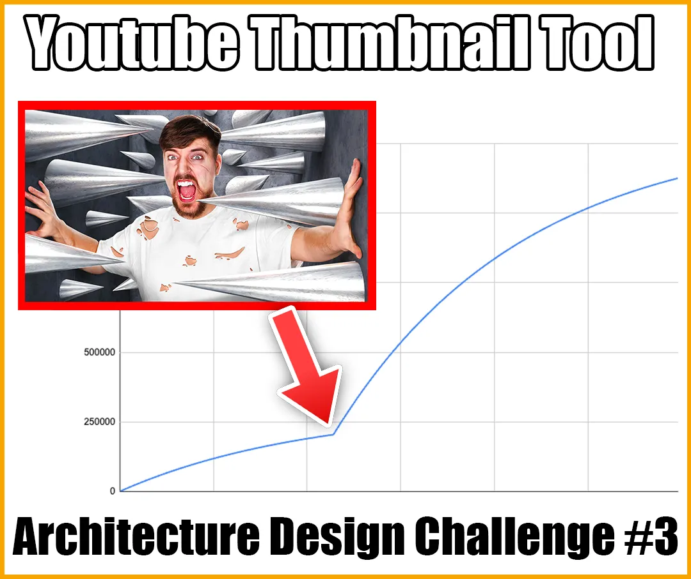

## **Business Details**

A YouTuber has contacted you and asked you to build a tool for them.

On YouTube, the thumbnail and title have an incredible effect on how many views your videos get. A better thumbnail and title can increase your views 20x!

Most big YouTube channels know this, so they design multiple thumbnails and titles for every video. If their video isn’t getting as many views as expected, they try another thumbnail or title until they find the best one.

Your client has realised that you can only learn so much from your own videos. They want you to build a tool that can track the videos of other YouTube channels and show when a video thumbnail or title changes. This will help them learn what kinds of thumbnails and titles are working at the moment.

## **Requirements**

### **Functionality**

- There’s an app where users can sign up.
  - Registration and login
  - Upgrade to paid membership to unlock more features.
- Users can submit a video to be monitored.
  - The views on the video are captured every hour for the first 7 days and then every day for 2 months.
  - If the thumbnail or title changes then record the change and store the new thumbnail. (note - the URL of the thumbnail doesn’t change even if there is a new image!)
  - Free users can only track 10 videos per month.
- Users can submit a channel for monitoring.
  - Every hour the channel is checked to see if there are any new videos. New videos are added to the tracking (as above).
  - Free users can monitor up to 3 channels, Paid users can track up to 100.
  - When monitoring a channel, if one of their videos updates its thumbnail or title you can receive an email. Users can opt in or out per channel.
- Users can view all currently tracked videos.
  - Filter based on whether the video ever had a thumbnail or title change.
  - Filter by channel.
- Users can view a graph of the views over time (like in the image for this challenge)
  - This needs to have markers for every time the title or thumbnail has changed. These show the before and after for the thumbnail and title.
- Paid users can A/B test their thumbnail variations.
  - They connect their YouTube channel to the app.
  - Select the video they want to A/B test.
  - Upload the alternative thumbnail.
  - Select the switching speed (change 4, 12, 24 or 48 hours) and the number of times to test each thumbnail.
  - Option to auto-deploy the highest viewed thumbnail at the end of the test.
  - Email summary at the end of the test.
  - They can view their test in the UI.
- Outliers Detection Service
  - Once a week a process runs over all tracked videos to find outliers. There are two kinds of outliers:
    - Channel outliers - videos that are getting way more views than expected for the channel.
    - Thumbnail Outliers - Videos that had a thumbnail or title change and saw a significant change in views after the change.
  - Assume that you have scripts to do the processing. You just need to provide them with the correct data. The scripts can:
    - Analyse a channel to calculate the ‘expected views’ range based on the age of a video.
    - Take a time series dataset of views and thumbnail changes and return whether this video counts as a ‘thumbnail outlier’.
  - Users get an email with outliers from the channels that they are monitoring.
  - Paid users can also view all outliers in the app.

### **Non Functional Requirements**

- This system needs to be able to monitor 10,000 channels, each creating an average of 1 video per week.
- 1000 videos can concurrently be going through A/B testing.
- The system needs to support 5000 free users and 500 paid users.
- Paid membership is $50/month.
