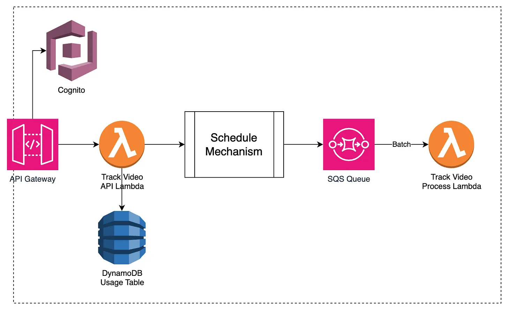
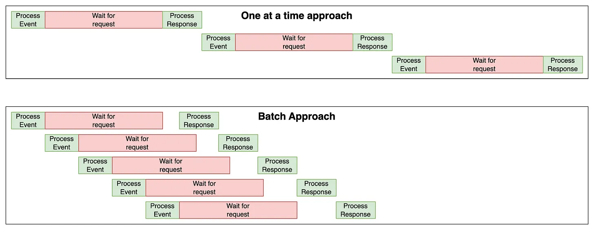
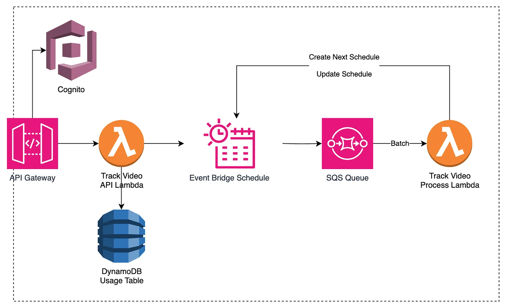
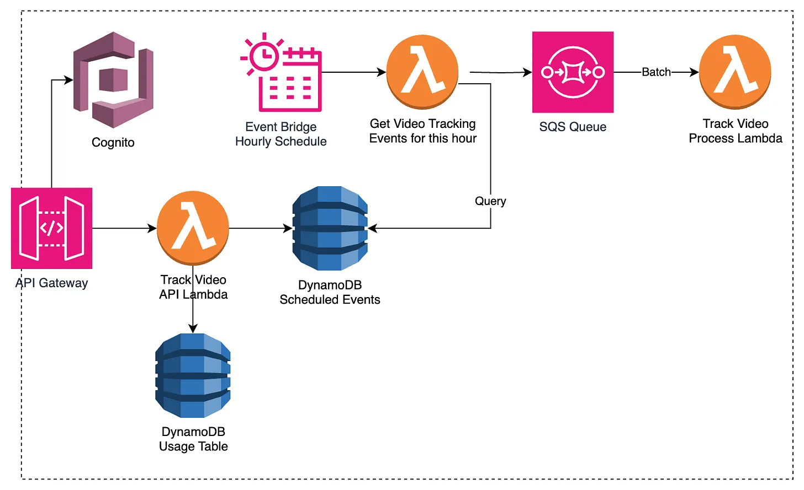
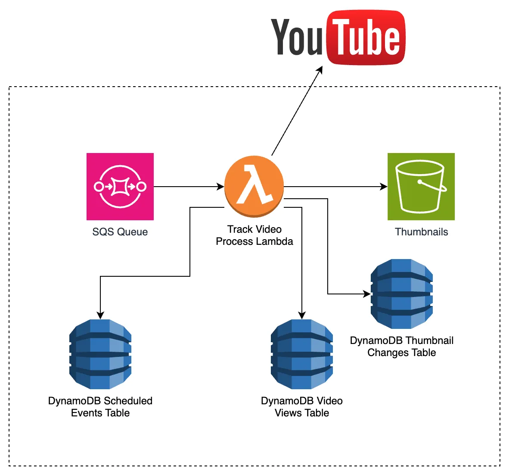
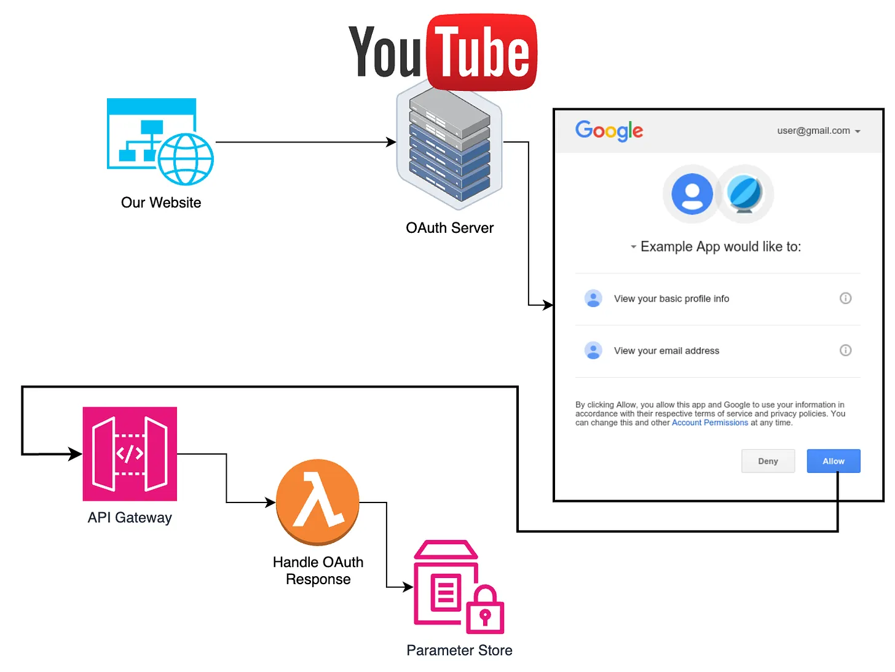
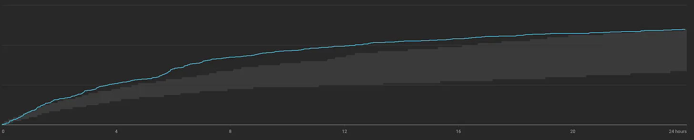
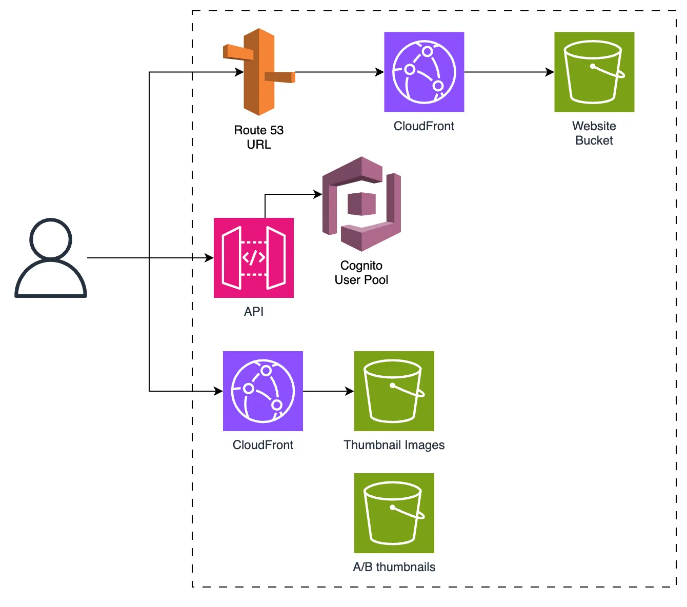

# **My Approach**

I’m going to split this architecture slightly differently this time. Instead of splitting by domain, I’m going to split by functionality. This is because there is very similar functionality (scheduling) happening in different domains. If I was building it, I would still split the app into microservices based on domain.

The functionality groups I’m going to use are:

- Scheduling and Batching
- Tracking
- A/B testing
- Outliers Detection
- General

## **Scheduling and Batching**

The core of this project will be the way that we schedule and manage all of the tracking events. These include checking video views and thumbnail changes, checking if a channel released a new video, changing thumbnails for A/B testing and running the weekly outlier analysis. For simplicity, I’ll call these **Tracking Events** from now on.

### **Batching Pattern**

Before we move on to how the batching will work I want to show a higher level diagram for how the whole process will work.



When a user tracks a video, that API request checks that they have the capacity (haven’t tracked too many videos this month), writes to a Dynamo table and triggers the scheduling mechanism. This will do its thing and when the schedule is due it will put an event onto an SQS queue.

I’ll have a set of Lambda functions that take batches of events from the SQS queue and process them. The diagram above shows the flow of an event for tracking a video but all of the other scheduled processes ( tracking channel video releases, monitoring AB tests etc) would have an equivalent architecture.

The reason that I want to use batches is to make the most of the Lambda processing time. If we processed one video at a time then we would spend most of the time waiting for the data requests. This is a waste of time and therefore money.



As you can see, if we batch events together we can process other events whilst waiting for the API response for the earlier ones. In this diagram, we can complete 5 batched events in less time than 2 events processed one at a time. Finding the optimal batch size would require some experimentation to find the perfect balance.

I would make sure to set a [maximum concurrency of Lambdas](https://aws.amazon.com/blogs/compute/introducing-maximum-concurrency-of-aws-lambda-functions-when-using-amazon-sqs-as-an-event-source/) per SQS queue and make it match the reserved capacity for that lambda. This would be different per event type as some will take longer and require more parallel Lambdas.

I would make sure to set up monitoring for the queues. Ideally, all of the events would be handled relatively soon after their trigger. Measuring the number of views 45 minutes past the hour because the queue took too long wouldn’t give consistent results.

I would rather over-provision than under-provision. It won’t cost anything extra.

### **Scheduling**

For scheduling, I had two patterns that I considered, so I’m going to explain both, the pros and cons and which one I would choose for this project. Both of these could be used in the batching pattern.

The two approaches are: \

- Creating an EventBridge Schedule for every tracking event \
- Creating an hourly EventBridge schedule for every **tracking type **but then storing each **tracking event **data in DynamoDB

Before we get started we’re going to crunch a few numbers.

Video tracking schedules triggered per channel per month: \
1 video/week/channel x 7 days of hourly tracking = 720 \
8 videos being tracked every day = 240

Channel new video checks = 1/hr = 720

Total Tracking Events per channel per month = 1680

A/B testing events = 1000 videos x 2 times a day = 6000

Total Tracking Events per month = 1680 x 10,000 = 16,806,000

We’ll use this for some calculations later.

#### **One EventBridge Schedule per Tracking Event**

This pattern is pretty simple. Each tracking event will have a schedule for when it is next supposed to run.



This event will have all of the details required to process that event as part of the event. For example, if I had just started tracking a channel, it would have a details section that looks like this:

```js
{
    "channelId": "someChannelId",
    "mostRecentVideoId": "videoId",
    "trackHourlyUntil": 1707213699121,
    "trackDailyUntil": 1709413699121
}
```

The downstream process can take this and check whether there is a new video from that channel without needing to get any other data.

The extra caveat with this approach is that the Lambda which processes the event also needs to create the next schedule. It can use the **until** timestamps to work out whether to schedule for the next hour or for the next day.

I did consider using CRON schedules, but this would add complexity in this case. Any time the event details change (a new video is released on the channel so we need to update the recent video Id) or the frequency changes (after 7 days change to daily, delete after 2 months) we’d have to have the Lambda do some more complex logic.

With 16.8 million tracking events, that would be 33.6 million EventBridge requests (one to create the schedule, one to execute it). At $1/million requests this costs $33.6/month

**Pros**

- Each tracking event has its own schedule.

- You could have their schedules spread throughout the hour so there isn’t a huge spike on the hour. (Spreading the events out might cause higher Lambda costs as batching would be less efficient.)

**Cons**

- The processing Lambda needs to create the next schedule. If there is a bug or issue that causes the Lambda to fail, you won’t create the next schedule and the video/channel won’t be tracked any more.

- It is more expensive than our next approach

- There is a 1,000,000 limit on concurrent schedules per region. We should only be at 91k (8 videos currently tracked per channel + 10k channel schedules + 1k A/B tests) but if this scaled 10x or if you wanted to change this to track videos for longer then it could become an issue.

#### **Events Stored in DynamoDB**

Don’t worry we’re not going to be using TTLs and Dynamo streams 🤣

Another approach is to store all of the tracking events in DynamoDB and then have a Schedule per tracking event type. These schedules would need to be created once and never changed. These triggered Lambdas would query the tables and put the events into the SQS for processing.



Now we can use TTLs the way they were meant to be used. When a video tracking is created, we create both a daily and hourly tracking record in DynamoDB. Each has a TTL that will remove it after 7 and 60 days respectively. TLL could take up to 48 hours to remove, but in testing it’s usually found to be closer to 15 minutes. Even if it does take a few hours that will have a tiny effect on the costs.

As our records are persistent if there is an issue in the downstream processes then the event will be picked up by the next query on the next hour/day.

Calculating the pricing on this architecture is a bit more difficult as we are charged per RCU/WCU. Querying 1000 records at 0.4KB = 400KB = 100RCU (or 50 if eventual concurrency. If you increase the size of the record to 0.6KB your cost changes. This means it’s not the number of records that matters, but the total size of the records.

I’m using On-Demand pricing for this

Video Tracking Record = 307B \
Channel Tracking Record = 92B

**Writing video tracking records**\
10,000 _ 4 vidoes _ 307B / 1024 B/KB = 11,992 KB / month \
11,992 KB / 1KB = 11,992 WCU \
11,992 \* $1.25/M WCU = $0.015

**Querying video tracking records**\
( 720 hourly query + 30 days _ 8 video ) _ 10,000 \* 307B / 1024 B/KB \
= 2,878,125 KB / month \
2,878,125 KB / 4 KB = 719,531 RCU (strongly consistent) or 359,766 RCU (eventually consistent) \
$0.25/M RCU = $0.18 strong or $0.09 eventual

**Querying channel tracking records**\
720 _ 10,000 _ 92B / 1024 B/KB = 646,875 KB / month \
646875 KB / 4KB = 161,718 RCU (strong) or 80859 RCU (eventual) \
$0.25/M RCU = $0.04 (strong) or $0.02 (eventual)

**Total cost =~ $0.125 / month**

**Pros**

- This is cheaper
- Theoretical infinitely scalable as there are no limits on Dynamo tables.
- No possibility of events disappearing if a process lambda breaks. You’ll just have an hour missing from the chart.

**Cons**

- All events are put into the queue at once. You don’t have the ability to space the events throughout the hour like the other approach. Whether you want that, up to you.
- You’ve got to design your PK SK well so you can query all of the records and avoid hot partitions. We’re getting at most 80k video tracking records = 23,984 KB = 3000 RCU (eventual) and the limit is 3000 RCU per second per shard. Trying to get all video tracking records at once will cause throttling. You could shard the partition or artificially increase the time to make all of the requests.

#### **My Choice**

I would go with the Dynamo mechanism. We still get the accuracy of the EventBridge scheduler (60s accuracy) but don’t have hundreds of thousands of schedules. This just seems like a pattern that will cause issues in the future with ‘lost events’.

Cost isn’t a factor as at $36/month, this will be a tiny amount vs the cost to develop it. If there was a very strong argument to have the events spread throughout the hour then I might consider the other approach. I would ask the client if this matters to them.

## **Tracking**

Now that we have the scheduling, we can move onto handling these tracking events. I’m going to describe how each tracking event will be handled.

### **Channel Tracking**

Every hour we need to check if a channel has released any new videos. For this we can just request the RSS feed for the channel and check if the most recent videoId matches the one on the tracking event.

If a new video has been published, we can create the appropriate video tracking records in dynamo and then update the channel tracking event with the new videoId.

I would have the schedule for the channel tracking slightly earlier than the video tracking so that a new video gets picked up by the video tracking schedule that runs 10 minutes later.

### **Video Tracking**

We need to find the views on a video, check whether the thumbnail or title has changed and store that data.



We can get the views by fetching the page for the video and scraping the views number.

The thumbnail URL is known based on the video Id. To see if the thumbnail has changed, we can get the smallest version of the thumbnail (minimum data and time) and hash it. We compare that new hash against the hash of the previous thumbnail (stored when the video was first tracked or when the thumbnail was last changed). We also compare the titles.

If the thumbnail did change, we save a low-resolution and high-resolution version to S3. These will be under known filenames and paths so the UI can easily access them.

With all of this we can save a videoViewRecord that contains the videoId, views and if the thumbnail or title changed, the before and after values (only store our S3 image URLs, not the actual URL in Dynamo).

If the thumbnail and title did change we need to update the video tracking record (or schedule details if you went with the scheduler approach) with the new thumbnail hash and/or title. We can also create another record in a new “thumbnail change” table. This will make it easier to see which videos have been updated when we get to the outlier analysis section.

## **A/B testing**

With the A/B testing, we can generate all of the ‘thumbnail changes at the time the test is created. Using a timestamp as part of the sort key would allow us to query for “all A/B test changes that are scheduled for this hour”. This means we don’t need to have our processing Lambda create the next test event (a pattern I said I prefer not to do.

Users will have uploaded the two (or maybe more if you want) versions of the thumbnail and/or title. The images will be stored in S3. Using S3 signed URLs would allow for the upload of high-resolution images without risking hitting the API Gateway event payload size limit.

When an event gets to the processing Lambda, it can get the image from S3, title from the event and then make the request to YouTube to change the thumbnail. The credentials for this will be stored in parameter store.

To be able to make this request, the user needs to have authenticated their account to ours. For this, we need to have an endpoint for the OAuth2.0 process and we need to request the correct scope of permissions. We first have a web page that redirects them to the Google OAuth server. When they accept the permissions we have requested, we handle an API requests and can store the required codes and credentials in Parameter Store.



We’ll also have a separate Lambda for the wrapup of the test process. This has a few extra steps that need to be done. It needs to

- gather all of the view data for the video and thumbnail/title changes.
- run this through an algorithm to calculate which thumbnail performed the best.
- send the results to the user.
- (optional) if the user has requested it, change the thumbnail and title to the highest-performing one.

## **Outliers Detection**

This changes things up a bit from most of the app. We’ll still have a schedule that triggers once a week, but we are doing much more advanced logic. Initially I would handle these outlier detection events using Lambda, but would make sure to monitor the costs. If the costs did get large or the batches had to become small to complete in 15 minutes, I would look to migrate this workload to Fargate.

### **Thumbnail Outliers**

This is the simplest of the two outliers to calculate. We also only need to analyse the videos where there was a thumbnail or title change in the last week. Luckily we stored all changes in their own table! We just need to filter out videos where the thumbnail has changed multiple times in a week.

For each video, all we need is the view and thumbnail change data. We can pass this into our analytics function and get whether this video noticed a significant change in views after changing the thumbnail or title. If it did, we can create a record in an “outlier” table.

### **Channel Outliers**

This one is a bit more complicated as it has two steps:

1. Calculate the channel expectation - Something that defines the minimum and maximum bounds for a normal. In the YouTube analytics console, you get a view like this. The grey area is the expected view range. You can easily see that this video initially did a lot better than the expected views and ended right in the upper bounds.



2. Calculate if any of the videos monitored in the last week go above that channel expectation.

Since we need to know the channel's expectations, we’ll have one processing event for each channel. To calculate the expectation you need to get all of the analytics for every video that they have (or at least the last 10-20).

Since this would be a large query that will happen every week it would be ideal if the algorithm could store a ‘snapshot’ so that we can just update it with the data from the last week.

This snapshot could be stored in a dynamo record or S3 depending on size. Later we’ll calculate that a video can be up to 17KB with all tracking data. With 20 videos we would be getting close to the 400KB limit on DynamoDB. I would test the snapshot generation with the most complicated data possible (20 videos with millions of views) and see if the snapshot gets anywhere close to the limit. If it does, use S3.

Once we’ve got the snapshot, we update it with the data from the last week. Then we can map over each video and see whether it is an outlier or not. All outliers are written to the outlier table for sending to users.

### **Sending the Email**

There are two approaches for this:

- For each user, query the outlier table for all of the channels that they are monitoring.
- For each channel that has an outlier, get all users that monitor it.

There will likely be far fewer channels with outliers than there are users. This makes it seem like option 2 would be more efficient, but there is an issue. Doing this in a distributed nature means that if a user was monitoring two different channels that were being processed by different Lambdas (or two different invocations) how/do they communicate?

You could say that you just get one email per channel that has an outlier. This solves the communication issue, but means that a user might end up getting 5 or 6 emails if lots of their channels have outliers.

A better approach would be to get all channels with outliers and store them as [Lambda global variables](https://completecoding.io/aws-lambda-global-variables-the-good-the-bad-the-ugly-aws-service-deep-dive/). Then you can batch up users, get all of the channels they monitor and check that against the outliers stored in the global variables. This means users will only get one email with all outliers. Using global variables reduces the number of queries to the DB, saving time and money (reduced Dynamo RCU and shorter Lambda runtime).

## **General**

We still have to have everything else that constitutes an application.

For hosting the UI I’ll go with a React app in S3 with CloudFront and Route 53.

All of our APIs would be secured with Cognito.

When a user upgrades to premium I would add an attribute to their Cognito user to make it easier to handle later. All subscriptions would be handled by Stripe.



#### **Usage Limits**

To track the channels that a user is monitoring I would have a many:many table. This way I can check which channels a user subs to, but also which user subscribes to a given channel. When a user monitors a new channel, I can check if they are already at their limit.

Users can also track individual videos as well. I would have a table with records for each video that a user wants to monitor. These would have a timestamp in the SK so that we can query to get all videos they monitored this month so we can limit to 10. \
PK: userId, SK: timestamp, PK2: userId: SK2: videoId, TTL: 6 months.

When a free user goes to view the tracking on a video, we check whether the video is from a channel they monitor or is one of the other videos they monitor. If not then we tell them they need to use one of their credits to track this video.

#### **Showing Tracking Data**

When a user views the tracking data for a video we can query all of the “views data” records for that video, neaten it up and send it to the frontend. This would be rendered as a graph where a user can see where a thumbnail or title changed.

A views data record would look something like this. when there isn’t a thumbnail or title change (normally) this object has a data size of 79B.

```js
{
    "pk": "EKw34V_8mLc",
    "sk": "monitor1670722214998",
    "date": 1670722214998,
    "views": 89,
    (optional)"previousThumbnailUrl": "Some S3 url",
    (optional)"updatedThumbnailUrl": "Some S3 url",
    (optional)"previousTitle": "old title",
    (optional)"updatedThumbnailUrl": "new title",
}
```

After just a week a video has 168 of these (12.96KB) and by the end of 2 months, it will be 221 (17KB). If each video analytics is viewed 500 times, that would be about 7250 KB of data read over 2 months. Some videos will have their tracking viewed a lot more than this (how many people want to see the data on Mr Beast videos?). Since there are 40,000 new videos per month, that would be 290 million KB of data read every month. That’s 72.5 million RCU (eventual) or $18.125 per month.

I did all of this calculation thinking it would be worth consolidating the records. Those 221 records could be cleaned to reduce the size down to a single 6.53KB record (61% reduction in size). But when you’re spending $18/month the ROI on building a feature even when it saves 61% is pointless.

This is an interesting example of working out the cost savings of a ‘better design’ before implementing it.

---

## **Self Review Questions**

Now I’ll go through the questions and answer them as best I can.

### **Project specific questions / things to watch out for**

- If two people track the same channel or video, do you do the work twice? - No, They would each have a record in the tables that maps users to channels or videos, but there would only be one channel monitoring record and one video monitoring record. This would create one monitoring event, so only be processed once.
- How many videos will you actively be tracking when at the required capacity? - 90,000 videos from the last 2 months (assuming 4.5 weeks per month).
- Are you creating a schedule for every video and channel or something different? - Two options are explained in the schedule section. Choose the Dynamo Approach so no.
  - Are there any limitations on the number of things scheduled in your design? - Not really. Dynamo tables can be huge. Partition key design needs to be considered but if done well won’t be a limiting factor.
- How do you efficiently tell whether a thumbnail has changed? The URL is the same even when the thumbnail changes. - We hash the image data and compare this against last week’s hash. If the image changes, the hash will change. This means we don’t have to read the last image from S3 for every check which would be expensive.
- When getting analytics for a video, a lot of the time spent is fetching the website page and image. Can you use this time optimally? - We batch so that we are processing multiple videos in the same Lambda. That wait time is spent processing the other videos.
- When viewing the data on a video (like the example image) how many database records are you querying? 221 (17KB)
  - Is there a way to optimise this? - Yes, we could create a consolidated record.
  - Is this necessary? - No. The cost even at full scale is $18/month. Event saving 61% would have an awful ROI.
- How are you ensuring that a user can only see the videos that they are following (or videos from channels that they follow)? User:Channel and User:Video mapping tables. We look up before getting the data.
- A YouTube channel reaches out and wants more details on outlier videos. How complicated would it be to:
  - Add further processing when an outlier is found. - Add a Dynamo Stream to the outlier table. Fire this into EventBridge and then have another queue and processing Lambda doing whatever extra processing they need.
  - Get the transcript of the video and then use AI to summarise. - There are APIs to get video transcripts. Doing it ourselves would be unnecessary complexity. This could be sent to Bedrock for summary.
  - Run an analysis on the thumbnails, titles and summaries to find trends in overperforming videos. - This would need to run after all of the outliers were found. Initially there would probably be very few outliers per week so we might need to get from across a few weeks to get a representative sample.
- Another channel asks if you are able to do higher-resolution video tracking.
  - What is the highest resolution that you could track? - With this architecture, I would suggest that it would be 2 minutes. EventBridge has an accuracy of 60s. If we offered 1 minute resolution then one event could be in the last second of the minute and the next would be a second later. This would be a 30X increase in out resolution.

### **Default Questions**

#### **Security:**

- How do you secure your data in transit? https
- How do you secure your data at rest? Dynamo and S3 are encrypted at rest.
- How is your architecture protected against malicious intent? Having a good org structure and locked down user access prevents devs accessing prod data.
  - APIs - Cognito auth. API GW has some level of built-in DDOS protection. If more is needed then add WAF in front.
  - Storage ( database and file storage ) - The database is only accessible by API and Lambda.

#### **Reliability:**

- How would your infra react if an availability zone went offline for an hour?
  - Would your application still be usable? All of the services used are multi-az so it would still work.
  - Would there be any temporary or permanent loss of data? Only loss would be if a lambda went online whilst processing an event.
  - Would that be acceptable? yes, it works through an az failure.
- How would your infra react if a whole region went offline for an hour?
  - Would your application still be usable? No, everything lives in one region. The sites would be cached in CloudFront but nothing else would work.
  - Would there be any temporary or permanent loss of data? Only data loss from currently running events/Lambdas. All data would be inaccessible but not lost. Events from third parties wouldn’t be processed - booking changes wouldn’t be accounted for.
  - Would that be acceptable? yes, the probability of a full region outage is very small. Building a multi region architecture would be, in my opinion, overkill. It would overcomplicate and slow down future development.
- How would your application react if your traffic increased 10x in 5 minutes? (An advert plays on tv) - an increase in active users means 2 things: increase in channels monitored and increase in video analytics viewed.
  - Would your compute and database scale up to handle this quick increase in traffic? - Yes. Lets assume we have 100 Lambda concurrency reserved for the processing Lambdas, we would be able to handle 2900 concurrent API requests, assuming we were scaling from 0.
  - Might you hit some service limits? We have 1000 concurrent lambdas by default. I doubt we’d ever get close to 900 concurrent API Lambdas. If we did we could lift that soft limit.
- If a developer added a recursive bug to the code that caused memory usage to spike, how would your application handle it? The lambda that contains that code would run out of memory and crash. This would make that function useless, but all of the other functions would work as normal. The joy of isolated functions.
- What would happen if your database was corrupted or accidentally deleted? - The tables are all configured with Point-In-Time recovery. I would also ensure that tables are configured with ‘retain’ as their deletion policy.

#### **Performance:**

- Might anything in your application cause user requests to fail to meet latency requirements? - No, simple APIs should return sub 1s response times with ease.
- How do you configure and optimise your compute resources? (EC2 instance type / Lambda memory) - Using Lambda instead of ECS/EC2 means that we don’t need to monitor CPU/RAM usage and autoscale as that’s done for us. I would default to using 1GB Lambda and then use the Lambda Powertuning to optimise further. I would have alarms for API Lambdas with a response time of 2s. If there are any that trigger that alarm we can re-run the powertuning or increase RAM until an acceptable response time is reached. This is very unlikely though. \
  For the analytics Lambdas, I would use X-Ray to see how much of the time is being wasted waiting for different batch sizes. I would also try to balance the RAM and batch size. This would require more manual testing as Powertuning can’t adjust the batch size.
- What should the team be monitoring to ensure optimal performance? - API response time, how long it takes for the last video tracking event to be processed each hour, analytics Lambda timeouts.

#### **Cost Optimisation:**

- What is the rough cost to run this application? \
  Lambda costs would massively vary based on the duration required to get the video data. Dynamo costs would be under $100/month. \
  Cognito (~$275/month) and CloudFront would still likely be the largest costs. The CloudFront costs would vary based on the number of times the analytics were viewed and how many thumbnail changes happened. \
  Revenue / month = $25,000
- What is the most expensive component of your application? - CloudFront and Cognito are ones to watch as they often aren’t accounted for. They will by far be the highest costs in our case.
- What designs/patterns have been implemented to optimise costs? \

* Use of Serverless to reduce operations costs and only pay for what we use. \
* Storing the smallest thumbnails for showing on the graph, but allowing users to download the higher res ones. \
* Storing the hash of the thumbnail in Dynamo for change comparison, instead of storing the full image. \
* Batching our processes to reduce Lambda invocations and wasted ‘waiting’ time. \
* Option to migrate the analytics processing to Fargate for reduced costs.

#### **Sustainability:**

- How does your architecture make the most of user usage patterns to improve sustainability? - Use of Serverless increases utilisation on the hardware, reducing total energy and material usage. Optimising costs means optimising sustainability since we’re using less.

```

```
